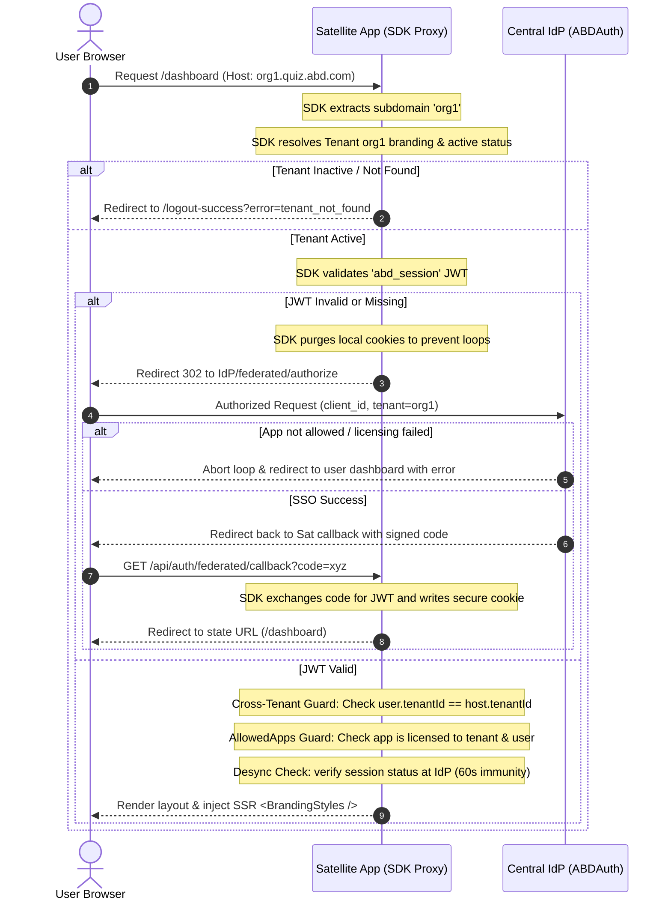

# Technical Documentation: `@abd/satellite-sdk` (v1.0.0)

This document specifies the technical architecture, cryptographic verification, security boundaries, and API signatures of the `@abd/satellite-sdk` package.

---

## 🗺️ Architectural Flow & Security Handshake

The SDK operates as a centralized middleware and server utility layer to enforce authentication, tenant isolation, and white-label branding.



---

## 🛠️ API Reference

### 1. Proxy Guard Decorator: `withIndustrialAuth(options)`
Higher-order function designed to intercept incoming requests at the Edge.

```typescript
export function withIndustrialAuth(options: IndustrialAuthOptions): (request: NextRequest) => Promise<NextResponse>;
```

#### Configuration Options (`IndustrialAuthOptions`):
- `appId`: Unique slug of the application (e.g., `'quiz'`).
- `clientId`: Client OAuth registration ID.
- `clientSecret`: Client Secret for session validation.
- `jwtSecret`: Secret used to cryptographically verify JWT signatures locally.
- `authProviderUrl`: Base URL of the Identity Provider (default: `process.env.AUTH_PROVIDER_URL`).
- `baseAppUrl`: Fallback URL of the satellite app (default: `process.env.NEXT_PUBLIC_APP_URL`).
- `publicPaths`: Path prefixes bypassed from authentication (default: `['/', '/logout-success']`).
- `intlMiddleware`: Optional `next-intl` or next/router middleware function to chain.

---

### 2. Catch-All API Route Handler: `createAuthRouteHandler(options)`
Generates a Next.js App Router API Route handler. Map this inside `src/app/api/auth/[...auth]/route.ts`.

#### Internal Paths Handled:
- `GET /api/auth/session`: Returns `{ authenticated: boolean, user?: UserProfile }`.
- `GET /api/auth/logout`: Clears session cookies and redirects to IdP logout (supports `?silent=true` to wipe cookies locally and return a 200).
- `GET /api/auth/federated/callback`: Exchanges the OAuth code for a JWT token, writing the `abd_session` cookie securely.

---

### 3. Server-Side Session Utilities

#### `getIndustrialSession(jwtSecret?)`
Decrypts and parses the JWT token stored in the `abd_session` cookie using `jose`.
```typescript
export async function getIndustrialSession(customSecret?: string): Promise<FederatedSession>;
```

#### `ensureIndustrialAccess(requiredRole?, jwtSecret?)`
Guards layout components, server actions, or custom API endpoints.
- Throws `UNAUTHORIZED_ECOSYSTEM_ACCESS` if the session is invalid.
- Throws `INSUFFICIENT_INDUSTRIAL_PRIVILEGES` if the user role does not match (unless the user has the `SUPER_ADMIN` role).
```typescript
export async function ensureIndustrialAccess(requiredRole?: string, customSecret?: string): Promise<UserProfile>;
```

---

### 4. Zero-FOUC White-Label Styles: `<BrandingStyles />`
React Server Component that resolves the tenant, calls `@abd/styles` to convert hex branding color parameters to Tailwind CSS v4 variables, and injects them synchronously in `<head>`.

```tsx
import { BrandingStyles } from '@abd/satellite-sdk';

// Usage inside root layout.tsx:
<head>
  <BrandingStyles />
</head>
```

---

### 5. Client Session Hooks: `SessionProvider` & `useSession()`
Client-side context to access session information reactively.
- **Provider**: `<SessionProvider initialSession={session}>` should wrap the application layout.
- **Hook**: `const { session, status, update } = useSession();` returns the session state (`status` can be `'loading' | 'authenticated' | 'unauthenticated'`).
